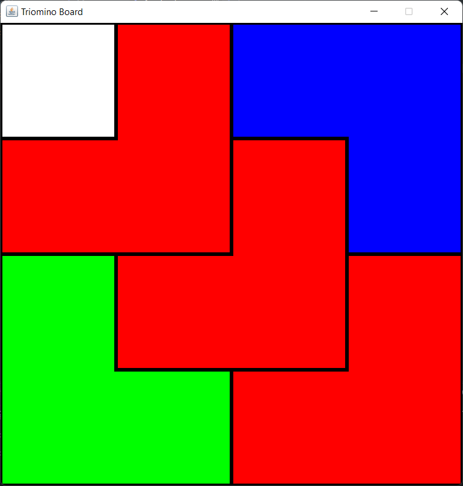
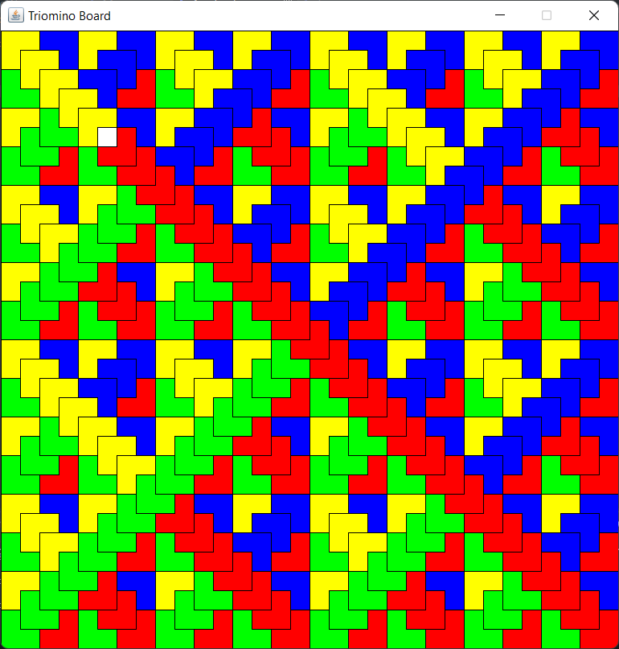
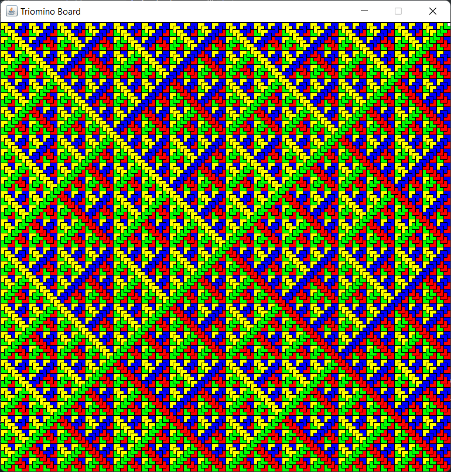
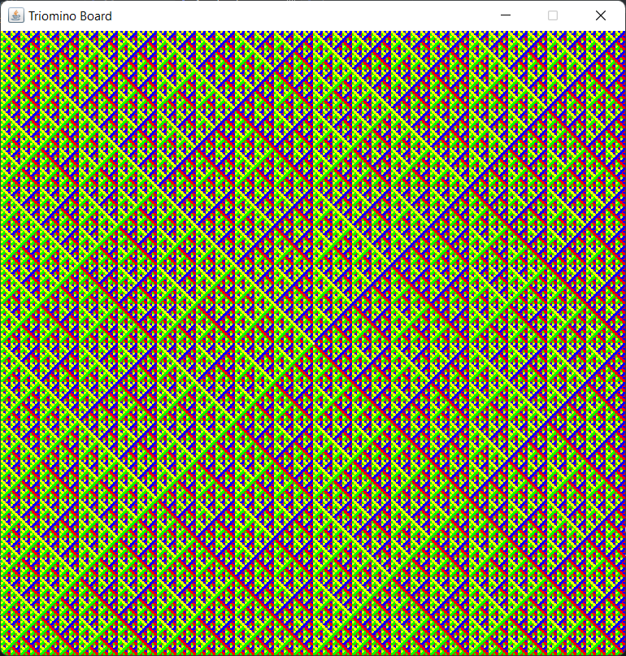

# Triomino Tiling

## Concept

Given a 2^n by 2^n board, the whole board can be filled by Triominos (3 square L pieces) with any single square missing.

## Usage

Triomino.jar is included for sample runs.

Running it will open a terminal (if one is not open already).

Input the board size and x,y location of the missing tile.
The board will be generated with the indicated tile missing.

## Compilation

Compile src into a runnable jar with Main as the main class.
